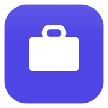

# Job Tracker (personal mini-ATS)

A local web app for tracking job applications like a lightweight CRM/ATS: a pipeline
dashboard, a drag-and-drop kanban board, companies, contacts (recruiters / hiring
managers / referrers), follow-up reminders, per-job activity timelines, and a CV
library where one CV can be attached to many jobs.

Everything runs on your machine — there's no backend server to deploy and no account
to sign up for. All data lives in the `data/` folder (a SQLite database plus your
uploaded CV files). `data/` is gitignored, so none of your actual job-search data ever
leaves your machine via this repo. A built-in backup system (see
[Backups & cloud save](#backups--cloud-save)) can snapshot everything automatically
into a cloud-synced folder so you never lose it and can move between machines.

## Quick start


<p align="center">
   Never touched a terminal before? This is all you need.
</p>

### macOS

1. **Install Node.js** (one time only) — download the **LTS** installer from
   [nodejs.org](https://nodejs.org/) and run it like any other app installer.
2. **Download this project** to your Mac (e.g. `git clone`, or download the ZIP from
   GitHub and unzip it) — anywhere you like, e.g. your Desktop.
3. **Double-click `Job Tracker.app`** in the project folder. First launch installs
   everything and takes a minute or two; it then opens your browser to the app
   automatically. Every time after that is instant.

Want it one click away? Drag `Job Tracker.app` onto your **Dock**, or right-click it →
**Add to Dock**, to launch it from there next time. **Don't move `Job Tracker.app` out
of the project folder** — it needs to stay next to `data/` and `app/` to work; make a
shortcut/alias elsewhere instead if you want it somewhere else.

→ More detail: [Running it as a desktop app](#running-it-as-a-desktop-app),
[Requirements](#requirements).

### Windows

1. **Install Node.js** (one time only) — download the **LTS** installer from
   [nodejs.org](https://nodejs.org/) and run it like any other app installer.
2. **Download this project** to your PC (e.g. `git clone`, or download the ZIP from
   GitHub and unzip it) — anywhere you like, e.g. your Desktop.
3. **Double-click `launch.bat`** in the project folder. First launch installs
   everything and takes a minute or two; it then opens your browser to the app
   automatically. Every time after that is instant.

Want it one click away? Right-click `launch.bat` → **Send to → Desktop (create
shortcut)**, or pin that shortcut to your **Start menu/taskbar**. (If you'd rather have
a proper `Job Tracker.exe` with an icon to pin instead, see the optional step in
[Running it as a desktop app](#running-it-as-a-desktop-app).) **Don't move `launch.bat`
out of the project folder** — it needs to stay next to `data/` and `app/` to work;
pin/shortcut it instead if you want quicker access.

→ More detail: [Running it as a desktop app](#running-it-as-a-desktop-app),
[Requirements](#requirements).

## Features

- **Dashboard** — active applications, interviews in progress, overdue follow-ups, and
  a merged "what's next" list across jobs and contacts.
- **Jobs** — table and kanban views, with a toggle to hide the "Interested" stage
  (widens the remaining kanban columns, or just filters the table rows).
- **Companies & People** — auto-created from jobs/contacts, with company summaries,
  logos (pulled from each company's real favicon), and a distinction between contacts
  you're speaking to vs. general connections.
- **Referral tracking** — mark which jobs came through a referral (and by whom) vs.
  open applications, with badges and a dashboard stat.
- **CV Library** — upload CVs, attach one to many jobs, or drop files straight into
  `data/files/` and click "Scan" to register them.
- **Backups & cloud save** — automatic snapshots every hour and on shutdown (plus a
  manual button), saved to a folder of your choice. Point that folder at Google Drive,
  Dropbox, iCloud, etc. and your data is safely in the cloud. A new machine auto-restores
  your latest backup on first launch. Managed from the **Settings** tab.
- **Hover tooltips** — hovering any truncated text (summaries, next steps, etc.) shows
  the full content in a small card at your cursor.
- **Desktop launcher** — double-click `Job Tracker.app` (macOS) or `launch.bat` (Windows)
  instead of using a terminal. It checks Node.js is installed, installs/updates
  dependencies, starts the server, and opens your browser automatically — and shuts the
  server back down once you close the app. See [Running it as a desktop app](#running-it-as-a-desktop-app).
- **AI-assisted importing** — this repo includes a [CLAUDE.md](CLAUDE.md) contract that
  lets [Claude Code](https://claude.com/claude-code) turn a pasted job posting or
  LinkedIn profile into a fully populated job/contact record, deduping and linking
  automatically. Optional — the app is fully usable without it.

## Requirements

- Node.js 18+ (that's it)

## Run it

**Easiest: double-click to launch** — see [Running it as a desktop app](#running-it-as-a-desktop-app)
below. No terminal needed.

**Or from a terminal:**

```bash
cd app             # all program files (and package.json) live in app/
npm install        # first time only (also installs the client)
npm start          # builds the UI and serves the app
```

Then open **http://localhost:3400**.

## Running it as a desktop app

After cloning/downloading this repo, you can launch Job Tracker with a normal double-click,
the same as any other app:

- **macOS** — double-click **`Job Tracker.app`**.
- **Windows** — double-click **`launch.bat`**. (Windows runs `.bat` files directly — no
  extra wrapper is needed for it to work. If you'd like a proper `Job Tracker.exe` with a
  custom icon instead, that's a one-time optional step: run `app\launcher\windows\make_exe.bat`
  on Windows. It uses the C# compiler that ships with Windows — nothing to install.)

Either way, the launcher automatically:
1. Checks that Node.js is installed (and tells you where to get it if not).
2. Reuses an already-running instance if you double-click again, instead of starting a
   second one.
3. Installs/updates dependencies (`npm install`) so things stay in sync after a `git pull`.
4. Starts the server in the background and waits for it to come up.
5. Opens your default browser to the app.
6. Watches for you to close the app — once no browser tab has been open for about a
   minute, the server shuts itself down (taking a backup first, per
   [Backups & cloud save](#backups--cloud-save)).

If anything goes wrong, check **`data/logs/app.log`** in the project folder — the launcher
writes everything there.

## Backups & cloud save

The app backs itself up **automatically every hour and whenever you close it** — you
don't have to do anything. By default those backups are saved on your own computer
(open the **Settings** tab to see them). To also keep them safe in the cloud — and to
be able to pick up on another computer — point the backup folder at a cloud-synced
folder. It takes about two minutes and needs **no accounts, keys, or setup inside the
app** — the app just saves files into the folder, and your cloud app uploads them.

### Set it up (one time)

1. **Install a cloud drive app and sign in** — whichever you already use is fine:
   Google Drive, Dropbox, iCloud Drive, OneDrive, or Box. This creates a folder on your
   Mac that syncs to the cloud automatically.
2. **Make a folder for your backups** inside it — e.g. a new folder called
   `JobTrackerBackups`. (Use a dedicated folder, not the top level of your drive.)
3. **Copy that folder's full path.** In **Finder**, find the folder, then **hold Option
   and right-click it → “Copy ‘JobTrackerBackups’ as Pathname.”** It's now on your clipboard.
   (Common locations, if you'd rather type it: Google Drive →
   `~/Library/CloudStorage/GoogleDrive-<you>@gmail.com/My Drive/…`, Dropbox → `~/Dropbox/…`,
   iCloud → `~/Library/Mobile Documents/com~apple~CloudDocs/…`.)
4. **Tell the app.** Open the **Settings** tab → paste the path into **Backup folder** →
   **Save settings**.
5. **Check it worked.** The badge should change from **“Local only”** to
   **“Cloud-synced · <your provider>”**. Click **Back up now** — the backup appears in
   the list *and* shows up in your cloud folder. Done.

**Alternative: sync the app's own backups folder in place.** Some cloud apps (e.g.
Google Drive's “sync this folder from computer”) can sync a folder *where it already
is* instead of you moving anything. In that case: leave the backup folder at its
default, tell your cloud app to sync the project's `data/backups` folder, and then in
**Settings** set **“This folder is synced by”** to your provider — the badge can't
auto-detect in-place syncing, so this tells the app it's cloud-synced. (The
**Reset to default** button next to the folder field brings back the default path any
time.)

### Moving to another computer

1. Install and run the app on the new computer (double-click the launcher, or `cd app && npm install && npm start`).
2. Sign that computer into the **same** cloud drive, so the backup folder syncs down.
3. Open **Settings** and set the **Backup folder** to that same folder.
4. Restart the app (`Ctrl+C`, then `npm start` — or just relaunch via the icon). It sees it's a fresh machine and
   **automatically restores your most recent backup** — your jobs, contacts, and CVs
   are all there.

**Two rules of thumb:** use one computer at a time (fully quit the app on the first,
let the cloud finish uploading, then open it on the second), and if your cloud app has
an “online-only / free up space” option, mark the backup folder **“Keep Downloaded”** so
a restore always has the real files to read.

## Other commands

```bash
cd app                    # run all of these from inside app/
npm run dev               # development mode (hot reload) at http://localhost:5173
npm run seed              # load a few sample jobs/companies/contacts to explore with
npm run import            # import a job from JSON (see CLAUDE.md)
npm run import-contact    # import a contact from JSON (see CLAUDE.md)
npm run scan-documents    # register CV files dropped straight into data/files/
```

To start fresh, stop the app and delete the `data/` folder.

## Project structure

```
Job Tracker.app/   macOS launcher — double-click to run
launch.bat         Windows launcher — double-click to run
data/              Your data: SQLite database, CVs, backups, logs — gitignored
app/               Everything else: the server, UI, scripts, launcher internals, docs
README.md          This file
CLAUDE.md          Contract for AI-assisted importing (must stay at the root)
```

For the full technical picture (data model, module structure, the backup/restore and
session-lifecycle design, and known gotchas), see [ARCHITECTURE.md](app/ARCHITECTURE.md).

## Privacy note

This is a personal tool built to track a real job search. The `data/` folder (your
applications, contacts, salary notes, and CV files) is excluded from git via
`.gitignore` and is never committed — only the application code is public.
